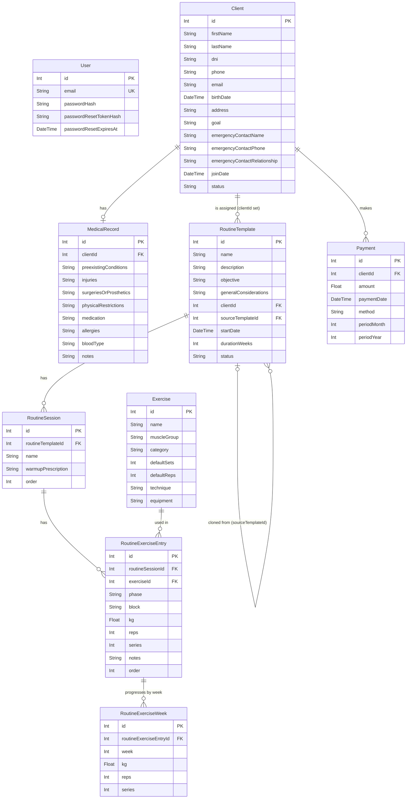

# Data Model Documentation

This document describes the data model for this gym management application, including entity descriptions, field definitions, relationships, and an entity-relationship diagram.

Scope: single-gym MVP (Phase 1). See [planning/user-stories-backlog.md](../planning/user-stories-backlog.md) for the user stories these entities were derived from. This is a first-cut model — treat it as living documentation, refined as each user story is implemented via OpenSpec changes.

## Model Descriptions

### 1. User
Represents the single admin user (gym owner/trainer) who can log in to the system. See US-001.

**Fields:**
- `id`: Unique identifier (Primary Key)
- `email`: Unique login email
- `passwordHash`: Bcrypt hash of the password (never store plain text)
- `passwordResetTokenHash`: Hash of the active password-reset token (optional)
- `passwordResetExpiresAt`: Expiration timestamp for the reset token (optional)
- `createdAt` / `updatedAt`: Timestamps

**Validation Rules:**
- Email is required, unique, valid email format
- Only one `User` row exists in the MVP, but modeled as a normal table (not a config singleton) to avoid rework if multi-user support is added later

### 2. Client
Represents a gym client. See US-002.

**Fields:**
- `id`: Unique identifier (Primary Key)
- `firstName`, `lastName`: Client's name
- `dni`: National ID/document number
- `phone`, `email`: Contact info (email optional)
- `birthDate`: Date of birth
- `address`: Optional address
- `goal`: Free-text training goal/observations (e.g. "weight loss")
- `emergencyContactName`, `emergencyContactPhone`, `emergencyContactRelationship`: Embedded emergency contact info (modeled as a Value Object per `docs/backend-standards.md` — no independent identity, so stored as plain columns rather than a separate table)
- `joinDate`: Date the client joined
- `status`: `active` | `inactive` (logical deactivation, no hard delete)
- `createdAt` / `updatedAt`: Timestamps

**Relationships:**
- `medicalRecord`: One-to-one (optional) relationship with MedicalRecord
- `routines`: One-to-many relationship with RoutineTemplate (client-assigned instances, see below)
- `payments`: One-to-many relationship with Payment

### 3. MedicalRecord
Represents a client's medical file. See US-003. One-to-one with Client, optional.

**Fields:**
- `id`: Unique identifier (Primary Key)
- `clientId`: Foreign key referencing Client (unique)
- `preexistingConditions`, `injuries`, `surgeriesOrProsthetics`, `physicalRestrictions`, `medication`, `allergies`: Free text
- `bloodType`: Optional
- `notes`: Free text
- `createdAt` / `updatedAt`: Timestamps

**Validation Rules:**
- Optional overall — a `Client` can exist without a `MedicalRecord`
- Only the current state is stored in the MVP (no history/versioning — Phase 2)

### 4. Exercise
Reusable exercise catalog entry. See US-004.

**Fields:**
- `id`: Unique identifier (Primary Key)
- `name`: Exercise name
- `muscleGroup`: Target muscle group
- `category`: `mobility` | `activation` | `main` — lets the trainer quickly filter warm-up vs main exercises when building a routine (US-005)
- `defaultSets`, `defaultReps`: Default prescription
- `technique`: Execution technique/description
- `equipment`: Required equipment
- `createdAt` / `updatedAt`: Timestamps

**Validation Rules:**
- No hard delete (create/edit only) to avoid breaking routines that reference an exercise

### 5. RoutineTemplate
A reusable routine template, or — when `clientId` is set — the actual routine instance assigned to a client (a clone of a template). See US-005 and US-006.

**Fields:**
- `id`: Unique identifier (Primary Key)
- `name`: Template/routine name (e.g. "Hypertrophy - Level 1")
- `description`: Free text
- `objective`: e.g. "hypertrophy", "weight loss"
- `generalConsiderations`: Free-text technique/RIR notes that apply to the whole routine
- `clientId`: Foreign key referencing Client (nullable — `null` means this is a reusable library template; non-null means this is a client's assigned routine instance)
- `sourceTemplateId`: Self-referencing foreign key to the `RoutineTemplate` this was cloned from (set only on client instances)
- `startDate`: Set only on client instances
- `durationWeeks`: Set only on client instances (e.g. 4)
- `status`: `draft` | `active` | `expired` (only meaningful for client instances)
- `createdAt` / `updatedAt`: Timestamps

**Validation Rules:**
- Assigning a routine to a client always clones a template (copies `RoutineTemplate` + its `RoutineSession`s + `RoutineExerciseEntry`s) rather than referencing it live, so future template edits don't retroactively change a client's already-assigned routine
- Only one active (`status = active`) `RoutineTemplate` per `clientId` at a time

**Relationships:**
- `sessions`: One-to-many relationship with RoutineSession
- `client`: Many-to-one relationship with Client (nullable)
- `sourceTemplate`: Many-to-one self-relationship (nullable)

### 6. RoutineSession
A single workout day within a routine (e.g. "Session A"). See US-005.

**Fields:**
- `id`: Unique identifier (Primary Key)
- `routineTemplateId`: Foreign key referencing RoutineTemplate
- `name`: e.g. "Session A"
- `warmupPrescription`: Free text, e.g. "2 rounds x 8 reps each"
- `order`: Display order within the routine

**Relationships:**
- `entries`: One-to-many relationship with RoutineExerciseEntry

### 7. RoutineExerciseEntry
A single exercise entry within a session — either part of the warm-up or the main block. See US-005.

**Fields:**
- `id`: Unique identifier (Primary Key)
- `routineSessionId`: Foreign key referencing RoutineSession
- `exerciseId`: Foreign key referencing Exercise
- `phase`: `warmup` | `main`
- `block`: Optional free-text superset/block label (e.g. "Block 1"), main phase only
- `kg`, `reps`, `series`: Default prescription for this entry (single value). When a weekly progression is present (see RoutineExerciseWeek), those per-week values are shown instead.
- `notes`: Optional observations
- `order`: Display order within the session/phase
- `weeks`: One-to-many relationship with RoutineExerciseWeek (optional weekly progression, US-018)

### 7b. RoutineExerciseWeek
An optional per-week override of an entry's prescription, enabling weekly
progression across a mesocycle. See US-018. Entries without weeks keep their
single kg/reps/series (backward compatible).

**Fields:**
- `id`: Unique identifier (Primary Key)
- `routineExerciseEntryId`: Foreign key referencing RoutineExerciseEntry (cascade delete)
- `week`: 1-indexed week number (unique per entry)
- `kg`, `reps`, `series`: Optional prescription for that week

### 8. Payment
A payment registered for a client. See US-007 and US-008.

**Fields:**
- `id`: Unique identifier (Primary Key)
- `clientId`: Foreign key referencing Client
- `amount`: Payment amount
- `paymentDate`: Date the payment was made
- `method`: `cash` | `bank_transfer` | `card`
- `periodMonth`, `periodYear`: The calendar month/year this payment covers
- `createdAt` / `updatedAt`: Timestamps

**Validation Rules:**
- Editable/deletable (not an immutable ledger), to allow correcting data-entry mistakes
- A client's payment status (up to date / overdue) is derived at query time from the most recent payment's covered period vs. the current date — not stored as a separate flag

## Entity Relationship Diagram

## Key Design Principles

1. **Single-tenant for now, multi-tenant-ready later**: no `gymId`/tenant column yet (out of MVP scope), but entities are modeled per-client rather than assuming global uniqueness, so adding a tenant scope later is additive rather than a redesign.
2. **Templates and client instances share one schema**: `RoutineTemplate` doubles as both the reusable library template (`clientId IS NULL`) and a client's assigned routine (`clientId` set, cloned from a template via `sourceTemplateId`). This avoids duplicating the session/exercise schema for both cases.
3. **Value Objects embedded, not normalized**: `EmergencyContact` fields live directly on `Client` (see `docs/backend-standards.md` Value Objects section) since they have no independent identity or lifecycle.
4. **Soft delete over hard delete**: `Client.status` and no-delete `Exercise` rows preserve history needed for payments/medical records/routines.
5. **Optional weekly progression**: `RoutineExerciseEntry` stores a single KG/REPS/SERIES value by default; a per-entry `RoutineExerciseWeek` list (US-018) optionally overrides it per week for a mesocycle. Medical-record-driven automation (contraindication warnings, medical record history) remains in the Phase 2 backlog.

## Notes

- All `id` fields are auto-incrementing primary keys.
- This model will evolve as each user story is implemented via OpenSpec changes (`openspec/changes/`) — treat this document as living documentation, updated after each change is applied.
- Email fields have unique constraints to prevent duplicate accounts 