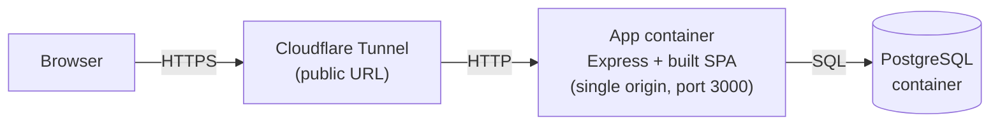

# Deployment Guide

This document describes how the gym management app is packaged and deployed, the
CI pipeline, and how secrets are managed. The whole app runs **single-origin**:
the backend serves the built frontend as static files, so the session cookie
(`httpOnly` + `secure` + `sameSite=strict`) stays same-site without any CORS
relaxation.

## Architecture



- **App container** (`Dockerfile`): a multi-stage build compiles the frontend
  (`vite build`) and the backend (`tsc` + `prisma generate`), then assembles a
  `node:20-alpine` runtime that serves the API under `/api/*` and the SPA for
  every other route. Behind `SERVE_FRONTEND=true` and `trust proxy`.
- **Database**: PostgreSQL container (or a managed instance on the cloud option).
- **Public URL**: a Cloudflare Tunnel (free) exposes the local app over HTTPS.

## Required environment variables (no secrets committed)

| Variable | Purpose |
|---|---|
| `DATABASE_URL` | PostgreSQL connection string |
| `JWT_SECRET` | Secret used to sign session JWTs (use a long random value) |
| `ADMIN_EMAIL` / `ADMIN_PASSWORD` | Seeded single admin account |
| `NODE_ENV` | `production` in deployment (enables the `secure` cookie) |
| `PORT` | App port (default 3000) |
| `SERVE_FRONTEND` | `true` to serve the built SPA (set by the image) |
| `DASHBOARD_DUE_SOON_DAYS` | Dashboard "due soon" threshold (default 5) |
| `RATE_LIMIT_DISABLED` | Optional; only honored outside production |

For the compose stack, `POSTGRES_USER` / `POSTGRES_PASSWORD` / `POSTGRES_DB` are
also required. Never commit real values — see "Secrets management" below.

## Option A — Local Docker + Cloudflare Tunnel (free, recommended)

1. Create an untracked `.env.prod` (gitignored) with the variables above, e.g.:

   ```env
   POSTGRES_USER=gymDbUser
   POSTGRES_PASSWORD=<a-strong-password>
   POSTGRES_DB=gymDb
   PORT=3000
   JWT_SECRET=<a-long-random-secret>
   ADMIN_EMAIL=admin@example.com
   ADMIN_PASSWORD=<a-strong-admin-password>
   DASHBOARD_DUE_SOON_DAYS=5
   ```

2. Build and start the stack:

   ```bash
   docker compose -f docker-compose.prod.yml --env-file .env.prod up -d --build
   ```

   Migrations run automatically on startup (`prisma migrate deploy`).

3. Seed the single admin (one-off):

   ```bash
   docker compose -f docker-compose.prod.yml --env-file .env.prod \
     run --rm app npx prisma db seed
   ```

4. Expose a public HTTPS URL with Cloudflare Tunnel (no paid account needed):

   ```bash
   # Install once: brew install cloudflared  (or see Cloudflare docs)
   cloudflared tunnel --url http://localhost:3000
   ```

   It prints a public `https://<random>.trycloudflare.com` URL. Because the app
   is single-origin and `trust proxy` is enabled, the `secure` session cookie
   works over the tunnel's HTTPS.

5. Tear down:

   ```bash
   docker compose -f docker-compose.prod.yml --env-file .env.prod down       # keep data
   docker compose -f docker-compose.prod.yml --env-file .env.prod down -v     # wipe data
   ```

## Option B — Render (free tier, optional)

`render.yaml` is a Blueprint that provisions a Docker web service + a free
PostgreSQL database. In the Render dashboard: **New → Blueprint** and point it at
the repo. `JWT_SECRET` is generated, `DATABASE_URL` is wired from the managed DB,
and `ADMIN_EMAIL` / `ADMIN_PASSWORD` are set as dashboard env vars (never in git).
The health check path is `/api/health`.

## CI pipeline (GitHub Actions)

`.github/workflows/ci.yml` runs on every push/PR:

- **backend**: `npm ci`, `prisma generate`, `npm test` (Jest — unit + integration).
- **frontend**: `npm ci`, `npm test` (Vitest), `npm run build`.
- **docker**: `docker build` of the production image (proves it assembles).

The backend job uses dummy `DATABASE_URL` / `JWT_SECRET` values because the
suite mocks Prisma and never touches a real database.

## Secrets management

- **Nothing secret is committed.** `backend/.env.example` documents the variables
  with empty/sample values; real values live in an untracked `.env` (dev),
  `.env.prod` (local prod, gitignored), platform env vars (Render dashboard), or
  GitHub Actions secrets (CI, if a deploy step is added).
- The `secure` cookie requires HTTPS in production; the Cloudflare Tunnel (or the
  cloud platform) terminates TLS, and `trust proxy` lets Express honor it.

## Notes

- Prisma on Alpine needs `openssl` + `libc6-compat` (installed in the image) and
  the `linux-musl-openssl-3.0.x` binary target (declared in `schema.prisma`).
- E2E can be pointed at any target via `PLAYWRIGHT_BASE_URL` (e.g. the running
  container or the tunnel URL).
