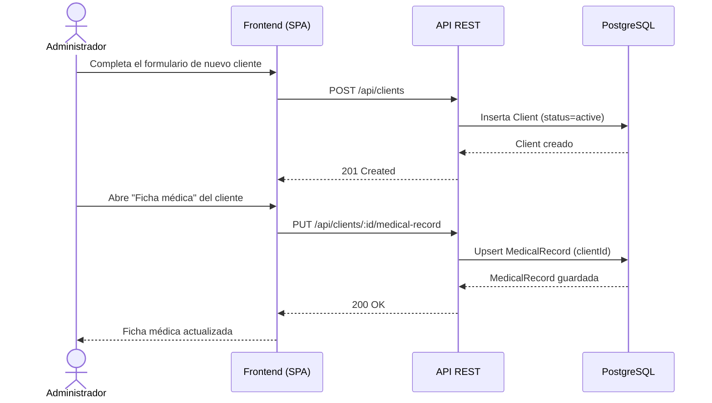
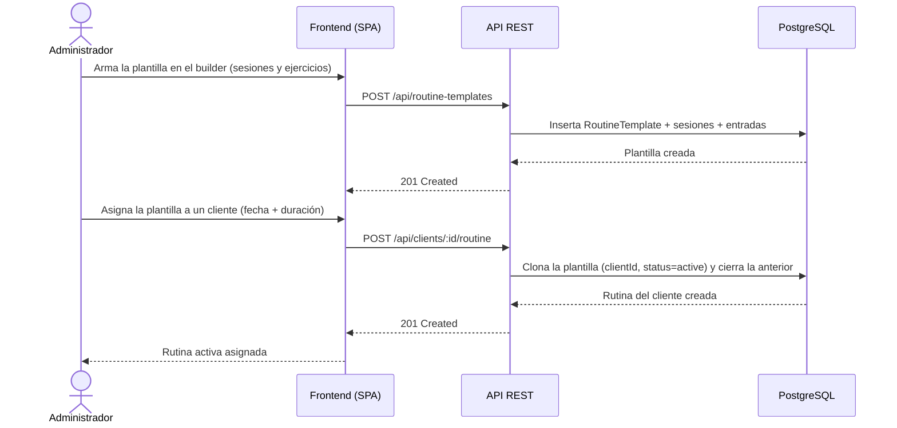
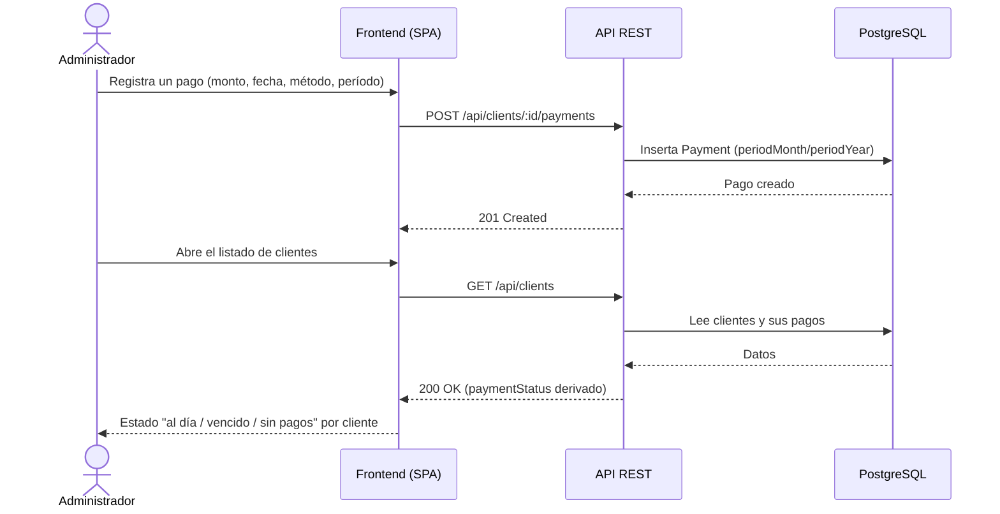
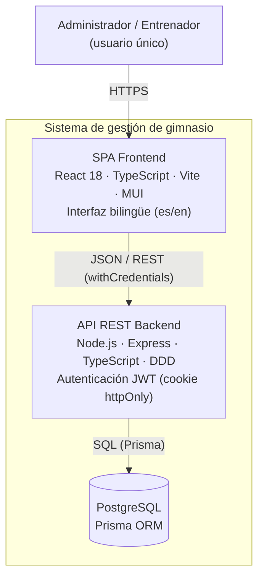
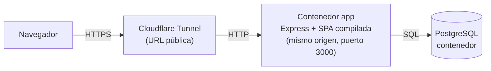
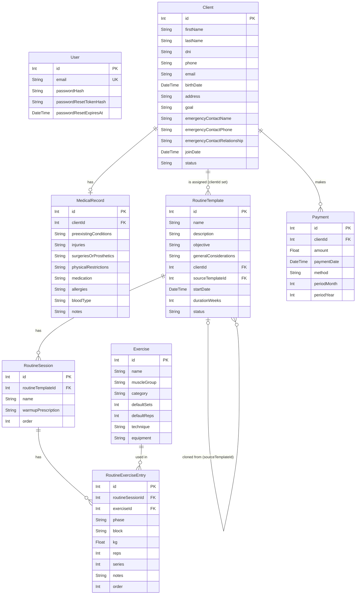

## Índice

0. [Ficha del proyecto](#0-ficha-del-proyecto)
1. [Descripción general del producto](#1-descripción-general-del-producto)
2. [Arquitectura del sistema](#2-arquitectura-del-sistema)
3. [Modelo de datos](#3-modelo-de-datos)
4. [Especificación de la API](#4-especificación-de-la-api)
5. [Historias de usuario](#5-historias-de-usuario)
6. [Tickets de trabajo](#6-tickets-de-trabajo)
7. [Pull requests](#7-pull-requests)

---

## 0. Ficha del proyecto

### **0.1. Tu nombre completo:**

### **0.2. Nombre del proyecto:**

### **0.3. Descripción breve del proyecto:**

### **0.4. URL del proyecto:**

> Puede ser pública o privada, en cuyo caso deberás compartir los accesos de manera segura. Puedes enviarlos a [alvaro@lidr.co](mailto:alvaro@lidr.co) usando algún servicio como [onetimesecret](https://onetimesecret.com/).

### 0.5. URL o archivo comprimido del repositorio

> Puedes tenerlo alojado en público o en privado, en cuyo caso deberás compartir los accesos de manera segura. Puedes enviarlos a [alvaro@lidr.co](mailto:alvaro@lidr.co) usando algún servicio como [onetimesecret](https://onetimesecret.com/). También puedes compartir por correo un archivo zip con el contenido


---

## 1. Descripción general del producto

> Describe en detalle los siguientes aspectos del producto:

### **1.1. Objetivo:**

Aplicación web para que un entrenador/dueño de gimnasio (usuario único) gestione
su operación diaria desde un solo lugar: clientes, fichas médicas, rutinas y
pagos. Resuelve la dispersión de esta información en planillas/papel y
automatiza la parte más repetitiva del día a día: armar rutinas para cada
cliente.

### **1.2. Características y funcionalidades principales:**

**MVP (Fase 1):**
- Login básico de usuario único (administrador/entrenador)
- Gestión de clientes (alta, edición, baja lógica, listado/búsqueda)
- Ficha médica por cliente (condiciones, lesiones, restricciones, contacto de emergencia)
- Catálogo de ejercicios reutilizable
- Plantillas de rutina (creación y duplicación) a partir del catálogo de ejercicios
- Asignación de rutina a cliente con vigencia
- Registro de pagos por cliente e historial completo de pagos
- Dashboard con alertas de pagos vencidos/por vencer y rutinas por vencer
- Interfaz bilingüe (español por defecto / inglés) con selector de idioma

**Backlog futuro (Fase 2, fuera del MVP):** recordatorios automáticos
(email/WhatsApp), pasarela de pago online, registro de asistencia/check-in,
seguimiento de progreso físico, planes de nutrición, soporte multi-tenant
(varios gimnasios), y exportación de rutinas a PDF/Excel.

Ver detalle de historias de usuario en [planning/user-stories-backlog.md](planning/user-stories-backlog.md).

### **1.3. Diseño y experiencia de usuario:**

> Proporciona imágenes y/o videotutorial mostrando la experiencia del usuario desde que aterriza en la aplicación, pasando por todas las funcionalidades principales.

**Sistema de diseño (US-011, refinado en US-012).** La app usa una identidad
visual de marca inspirada en el material del gimnasio (negro + verde hoja +
blanco), centralizada en un tema MUI (`frontend/src/theme/theme.ts`) con
tipografía **Inter** auto-alojada, tokens de color y overrides de componentes.
Todas las pantallas comparten un *app shell* (`components/AppLayout.tsx`) con una
**barra superior** persistente (logo/marca "SPORT – FITNESS", selector de idioma
y cerrar sesión) y una **barra lateral de navegación** (Panel / Clientes /
Ejercicios / Rutinas) que en pantallas chicas se colapsa en un menú. La barra
superior incluye además una **campanita de notificaciones** con un contador de
alertas (pagos vencidos/por vencer, clientes sin pagos y rutinas por vencer) y
un desplegable que enlaza a cada cliente, visible desde cualquier pantalla. Las
páginas internas comparten un encabezado consistente (`PageHeader`), muestran
*skeletons* de carga y notifican las acciones con *snackbars*.

**Recorrido del usuario:**

1. **Acceso** — El usuario aterriza en una pantalla de login con la cabecera de
   marca (logo + nombre + lema) y el selector de idioma. Puede recuperar su
   contraseña desde el enlace correspondiente.
2. **Panel** — Tras autenticarse llega al panel, dentro del shell con la barra
   superior de marca y la **barra lateral de navegación** (Panel / Clientes /
   Ejercicios / Rutinas). El panel muestra cuatro grupos de alertas como
   **tarjetas** (con icono, conteo y color: pagos vencidos, pagos por vencer,
   clientes sin pagos y rutinas por vencer), cada cliente enlazando directamente
   a su pantalla de pagos o rutina.
3. **Clientes** — Lista con búsqueda por nombre y filtro por estado (`DataGrid`),
   alta/edición mediante formularios, y baja lógica con diálogo de confirmación.
   Cada pantalla interna ofrece un botón "Atrás" consistente para volver.
4. **Ficha médica** — Desde el listado, la acción "Ficha médica" abre una
   pantalla propia por cliente con condiciones, lesiones, medicación, alergias,
   grupo sanguíneo y notas. Muestra un estado vacío cuando aún no hay ficha y
   guarda mediante upsert.
5. **Ejercicios** — Desde el panel, "Ejercicios" abre el catálogo (`DataGrid`
   con búsqueda por nombre y filtro por categoría). Alta/edición mediante
   formulario; sin borrado. Trae un set base sembrado al iniciar.
6. **Rutinas** — Desde el panel, "Rutinas" abre la biblioteca de plantillas. El
   builder permite armar una rutina con varias sesiones, cada una con entrada en
   calor y bloque principal, eligiendo ejercicios del catálogo (con kg/reps/
   series/notas). Se puede **duplicar** una plantilla en una copia independiente.
7. **Rutina del cliente** — El listado de clientes muestra quién tiene rutina
   asignada. Desde la acción "Rutina" se abre una pantalla que muestra la rutina
   activa (o estado vacío), permite **asignar** una plantilla (con fecha de
   inicio y duración) y ver el **historial**. Asignar una nueva cierra la
   anterior.
8. **Pagos del cliente** — El listado de clientes muestra el estado de pago
   (al día / vencido / sin pagos) y permite **filtrar** por ese estado además de
   por nombre y estado (activo/inactivo). Las acciones de cada fila (editar, ficha
   médica, rutina, pagos, desactivar/reactivar) son **iconos compactos con
   tooltip**, de modo que caben sin scroll horizontal. Desde la acción "Pagos" se
   abre una pantalla que lista los pagos y permite **registrar / editar /
   eliminar** pagos (monto, fecha, método, período mes/año). El estado se
   recalcula automáticamente. Además, el botón **"Exportar PDF"** descarga el
   historial de pagos del cliente como un documento PDF (bilingüe, según el
   idioma activo).
9. **Idioma** — En cualquier momento el usuario cambia entre español e inglés
   desde la barra superior; la preferencia persiste entre recargas.

> _Capturas / videotutorial: pendientes de incorporar._

### **1.4. Instrucciones de instalación:**

**Requisitos previos:** Node.js `20.19.0`+ (recomendado gestionarlo con `nvm`),
npm `10`+, Docker + Docker Compose, y Git.

```bash
# 1. Clonar el repositorio
git clone <url-del-repo>
cd AI4Devs-finalproject

# 2. Levantar la base de datos PostgreSQL (Docker)
docker compose up -d

# 3. Backend
cd backend
cp .env.example .env          # completar JWT_SECRET, ADMIN_EMAIL, ADMIN_PASSWORD
npm install
npx prisma migrate deploy     # aplicar migraciones
npx prisma db seed            # crear el usuario admin desde el .env
npm run dev                   # API en http://localhost:3000

# 4. Frontend (en otra terminal, desde la raíz)
cd frontend
cp .env.example .env          # VITE_API_URL=http://localhost:3000
npm install
npm run dev                   # App en http://localhost:5173
```

Credenciales por defecto del admin (definidas en `backend/.env`):
`admin@example.com` / `ChangeMe123!`.

> Detalle ampliado en [docs/development_guide.md](docs/development_guide.md).

### **1.5. Casos de uso principales:**

A continuación se describen los casos de uso más representativos del MVP. Cada
uno incluye un diagrama de secuencia (Administrador ↔ Frontend ↔ API ↔ Base de
datos) y una breve explicación.

#### Caso 1 — Alta de cliente con ficha médica



- El administrador da de alta al cliente y, opcionalmente, registra su ficha
  médica (relación uno-a-uno opcional).
- La ficha se guarda mediante *upsert*: crea o actualiza según exista o no.

#### Caso 2 — Armar una plantilla de rutina y asignarla a un cliente



- Las plantillas son reutilizables; al asignarlas se **clonan** en una instancia
  propia del cliente, de modo que editar la plantilla no afecta rutinas ya
  asignadas.
- Solo puede haber una rutina activa por cliente: asignar una nueva cierra la
  anterior.

#### Caso 3 — Registrar un pago y derivar el estado



- El estado de pago no se almacena: se **deriva** en consulta a partir del
  período más reciente frente a la fecha actual, y se recalcula tras cada
  registro, edición o borrado.

---

## 2. Arquitectura del Sistema

### **2.1. Diagrama de arquitectura:**
> Usa el formato que consideres más adecuado para representar los componentes principales de la aplicación y las tecnologías utilizadas. Explica si sigue algún patrón predefinido, justifica por qué se ha elegido esta arquitectura, y destaca los beneficios principales que aportan al proyecto y justifican su uso, así como sacrificios o déficits que implica.

La aplicación es un monorepo con una SPA (frontend) que consume una API REST
(backend) respaldada por PostgreSQL. La arquitectura sigue el **modelo C4** a
nivel de contenedor (C2) y, en el backend, el patrón **Domain-Driven Design
(DDD) por capas**.



**Por qué esta arquitectura:**
- **Separación SPA + API REST**: permite evolucionar frontend y backend de forma
  independiente y facilita el testeo por capas.
- **DDD por capas en el backend** (dominio → aplicación → infraestructura →
  presentación): aísla la lógica de negocio de los detalles de framework y base
  de datos, mejorando la mantenibilidad y la testabilidad.
- **Prisma + PostgreSQL**: tipado fuerte de extremo a extremo y migraciones
  versionadas.

**Sacrificios / límites (MVP):** despliegue local (Docker Compose) sin capa de
orquestación cloud todavía; usuario único; sin multi-tenant. Ver el backlog de
Fase 2 en [planning/user-stories-backlog.md](planning/user-stories-backlog.md).

### **2.2. Descripción de componentes principales:**

> Describe los componentes más importantes, incluyendo la tecnología utilizada

- **SPA Frontend** (`frontend/`): React 18 + TypeScript + Vite, UI con Material
  UI (MUI) y un tema de marca centralizado, enrutado con React Router, estado de
  sesión por contexto e internacionalización (español/inglés) con
  `react-i18next`. Se comunica con el backend vía Axios (`withCredentials`).
- **API REST Backend** (`backend/`): Node.js + Express + TypeScript siguiendo
  DDD por capas (dominio, aplicación, infraestructura, presentación).
  Autenticación por JWT en cookie `httpOnly`/`secure`/`sameSite=strict`,
  validación de entrada con Zod y *rate limiting* en el login.
- **Base de datos PostgreSQL**: accedida mediante Prisma ORM (schema y
  migraciones versionadas); se levanta localmente con Docker Compose.

### **2.3. Descripción de alto nivel del proyecto y estructura de ficheros**

Monorepo con el backend y el frontend como carpetas separadas en la raíz, más
la documentación técnica y los artefactos de spec-driven development.

```
.
├── backend/            # API Node.js + Express + TypeScript (arquitectura DDD por capas)
│   ├── src/
│   │   ├── domain/         # entidades y contratos de repositorio
│   │   ├── application/     # servicios (lógica de negocio) y validación
│   │   ├── infrastructure/  # implementaciones Prisma, email, logger
│   │   ├── presentation/    # controllers HTTP
│   │   ├── routes/ middleware/
│   │   └── index.ts
│   └── prisma/          # schema, migraciones y seed
├── frontend/           # SPA React + TypeScript + Vite + MUI
│   ├── src/
│   │   ├── pages/ components/ context/ services/
│   └── e2e/             # tests end-to-end (Playwright)
├── docs/               # estándares y documentación técnica (fuente de verdad)
├── ai-specs/           # agentes y skills reutilizables para asistentes de IA
├── openspec/           # changes (spec-driven) y specs consolidados
├── planning/           # backlog de historias de usuario
└── docker-compose.yml  # PostgreSQL local
```

El backend sigue **Domain-Driven Design (DDD)** con capas (dominio, aplicación,
infraestructura, presentación). El flujo de desarrollo usa **OpenSpec**
(spec-driven): cada funcionalidad se define como un *change* (propuesta, spec,
diseño y tareas) antes de implementarse, y al terminar se archiva promoviendo
su spec a `openspec/specs/`.

### **2.4. Infraestructura y despliegue**

> Detalla la infraestructura del proyecto, incluyendo un diagrama en el formato que creas conveniente, y explica el proceso de despliegue que se sigue

La aplicación se despliega **single-origin**: el backend sirve el build del
frontend como archivos estáticos, de modo que la cookie de sesión
(`httpOnly` + `secure` + `sameSite=strict`) queda del mismo origen sin relajar
CORS. Todo se empaqueta en una imagen Docker multi-stage.



**Proceso de despliegue (opción recomendada, gratis):**
1. `docker compose -f docker-compose.prod.yml --env-file .env.prod up -d --build`
   (las migraciones se aplican solas al iniciar con `prisma migrate deploy`).
2. Seed del admin único: `... run --rm app npx prisma db seed`.
3. URL pública con **Cloudflare Tunnel**: `cloudflared tunnel --url http://localhost:3000`.

Como alternativa cloud (free tier) hay un **`render.yaml`** (Blueprint: web
service Docker + PostgreSQL gestionado). Detalle completo, variables y gestión de
secretos en **[docs/deployment.md](docs/deployment.md)**.

**Sacrificios / límites:** el despliegue lo ejecuta el responsable de forma
local + túnel (no hay entorno cloud permanente en el MVP); los free tiers cloud
tienen *cold starts* / expiración de la BD.

### **2.5. Seguridad**

> Enumera y describe las prácticas de seguridad principales que se han implementado en el proyecto, añadiendo ejemplos si procede

- **Autenticación por sesión JWT en cookie `httpOnly` + `secure` +
  `sameSite=strict`**: el token no es accesible desde JavaScript (mitiga XSS de
  robo de sesión) y no viaja cross-site (mitiga CSRF). `trust proxy` permite la
  cookie `secure` detrás del túnel HTTPS.
- **Contraseñas con hash bcrypt** (nunca en texto plano); token de recuperación
  almacenado hasheado y con expiración.
- **Rutas protegidas por middleware de autenticación**; el frontend usa un
  `ProtectedRoute` que redirige a `/login`.
- **Validación de entrada con Zod** en todos los endpoints de escritura.
- **Rate limiting** en `login` y `forgot-password` (10 y 5 intentos / 15 min);
  desactivable **solo fuera de producción** vía `RATE_LIMIT_DISABLED`.
- **Prisma ORM**: consultas parametrizadas (evita inyección SQL).
- **Sin secretos en el repositorio**: variables por entorno / secrets de la
  plataforma; `.env`/`.env.prod` están en `.gitignore`.
- **Baja lógica** (soft delete) en clientes y catálogo, preservando integridad
  referencial.

### **2.6. Tests**

> Describe brevemente algunos de los tests realizados

- **Backend (Jest, 268 tests, cobertura ~98%, umbral 90%)**: unitarios de
  dominio (estado de pago derivado, vencimiento de rutina), servicios (con
  repositorios mockeados) e **integración** de rutas con `supertest` (códigos
  200/201/204/400/401/404, autenticación, y el servido single-origin).
- **Frontend (Vitest + Testing Library, 65 tests)**: componentes, diálogos,
  páginas y servicios (con axios mockeado), incluyendo estados vacíos, errores y
  navegación.
- **E2E (Playwright)**: 14 tests que cubren los flujos principales (login,
  clientes, ficha médica, ejercicios, rutinas, pagos + export PDF, dashboard,
  i18n). Se pueden apuntar a cualquier destino con `PLAYWRIGHT_BASE_URL` (se
  validó el flujo principal contra la imagen Docker de producción).
- **Comandos:** `cd backend && npm test` · `cd frontend && npm test` ·
  `cd frontend && npm run test:e2e`.

---

## 3. Modelo de Datos

### **3.1. Diagrama del modelo de datos:**

> Recomendamos usar mermaid para el modelo de datos, y utilizar todos los parámetros que permite la sintaxis para dar el máximo detalle, por ejemplo las claves primarias y foráneas.

El siguiente diagrama entidad-relación refleja el modelo del MVP. La fuente de
verdad detallada (tipos, restricciones y reglas de validación) está en
[docs/data-model.md](docs/data-model.md).



### **3.2. Descripción de entidades principales:**

> Recuerda incluir el máximo detalle de cada entidad, como el nombre y tipo de cada atributo, descripción breve si procede, claves primarias y foráneas, relaciones y tipo de relación, restricciones (unique, not null…), etc.

- **User** — Usuario administrador único (dueño/entrenador) que inicia sesión.
  `email` es único; la contraseña se almacena como hash. Modelado como tabla
  normal para facilitar multiusuario en el futuro.
- **Client** — Cliente del gimnasio. Incluye datos de contacto, objetivo y el
  contacto de emergencia embebido (Value Object). Baja lógica vía `status`
  (`active`/`inactive`), sin borrado físico.
- **MedicalRecord** — Ficha médica del cliente. Relación uno-a-uno **opcional**
  con `Client` (`clientId` único); guarda condiciones, lesiones, medicación,
  alergias, grupo sanguíneo y notas.
- **Exercise** — Entrada del catálogo reutilizable de ejercicios, clasificada
  por `category` (`mobility`/`activation`/`main`). Sin borrado físico para no
  romper rutinas que la referencian.
- **RoutineTemplate** — Plantilla de rutina reutilizable (`clientId` nulo) o
  instancia asignada a un cliente (`clientId` seteado, clon de una plantilla vía
  `sourceTemplateId`). Una sola instancia `active` por cliente.
- **RoutineSession** — Día de entrenamiento dentro de una rutina, con su entrada
  en calor y su orden de visualización.
- **RoutineExerciseEntry** — Ejercicio dentro de una sesión, en fase `warmup` o
  `main`, con prescripción (`kg`/`reps`/`series`), bloque opcional y notas.
- **Payment** — Pago registrado para un cliente (monto, fecha, método y período
  mes/año). Editable/eliminable; el estado de pago (al día/vencido) se **deriva**
  en consulta a partir del período más reciente vs. la fecha actual.

> Detalle completo de tipos, restricciones y reglas de validación en
> [docs/data-model.md](docs/data-model.md).

---

## 4. Especificación de la API

> Si tu backend se comunica a través de API, describe los endpoints principales (máximo 3) en formato OpenAPI. Opcionalmente puedes añadir un ejemplo de petición y de respuesta para mayor claridad

---

## 5. Historias de Usuario

> Documenta 3 de las historias de usuario principales utilizadas durante el desarrollo, teniendo en cuenta las buenas prácticas de producto al respecto.

**Historia de Usuario 1 — US-001: Autenticación del administrador (single admin)**

> Como dueño/entrenador del gimnasio (usuario administrador único), quiero
> loguearme con email/contraseña y poder recuperar mi contraseña si la olvido,
> para que solo yo pueda acceder a los datos de clientes, fichas médicas y pagos.

- **Criterios de aceptación:** login con credenciales válidas inicia sesión
  persistente; credenciales inválidas se rechazan; todas las demás rutas quedan
  protegidas; recuperación de contraseña por email que responde igual exista o
  no la cuenta (no revela su existencia); token de reset de un solo uso y con
  expiración; rate limiting en login y forgot-password.
- **Estado:** Implementada y archivada (ver
  [detalle completo](planning/user-stories-backlog.md) y el spec en
  `openspec/specs/admin-authentication/spec.md`).

**Historia de Usuario 2 — US-002: Gestión de clientes (CRUD)**

> Como dueño/entrenador, quiero crear, ver, editar y dar de baja perfiles de
> clientes, para tener un solo lugar con los datos básicos de mis clientes.

- **Criterios de aceptación:** alta con campos obligatorios (nombre, apellido,
  DNI único de 7-8 dígitos, teléfono, email, fecha de nacimiento) y opcionales
  (dirección, objetivo, contacto de emergencia); validación de formato; baja
  lógica (no borrado) con posibilidad de reactivar; listado con búsqueda por
  nombre y filtro por estado; DNI duplicado rechazado; todo protegido por
  autenticación.
- **Estado:** Implementada (ver
  [detalle completo](planning/user-stories-backlog.md) y el spec en el change
  `openspec/changes/add-client-management/`).

**Historia de Usuario 3 — US-010: Interfaz bilingüe (español/inglés)**

> Como dueño/entrenador, quiero la interfaz disponible en español e inglés con
> un selector de idioma, para poder usar la app en mi propio idioma.

- **Criterios de aceptación:** la app arranca en el idioma del navegador (o
  español por defecto); un selector permite cambiar entre español e inglés y
  la preferencia persiste entre recargas; todas las pantallas y los mensajes
  de error están traducidos. El código (claves de traducción, identificadores,
  comentarios) se mantiene en inglés según los estándares; solo se traducen
  los textos visibles.
- **Estado:** Implementada (`react-i18next`; ver
  [detalle completo](planning/user-stories-backlog.md) y el change
  `openspec/changes/add-bilingual-ui/`).

**Historia de Usuario 4 — US-011: Shell de aplicación, navegación y tema visual**

> Como dueño/entrenador, quiero una identidad visual coherente (colores y logo
> del gimnasio) y una navegación consistente con barra superior y botón de
> "atrás", para moverme por la app con comodidad y que se sienta como un
> producto terminado.

- **Criterios de aceptación:** un tema de marca central (MUI `createTheme`:
  verde hoja como color primario, negro y blanco) aplicado a toda la app; una
  barra superior persistente (`AppBar`) con el logo/marca "SPORT – FITNESS", el
  selector de idioma y el botón de cerrar sesión, presente en todas las
  pantallas autenticadas; navegación "atrás" consistente en las pantallas
  internas mediante un componente `BackButton`; una cabecera de marca en las
  pantallas públicas (login, recuperación); el logo actúa como enlace al inicio.
- **Estado:** Implementada (ver
  [detalle completo](planning/user-stories-backlog.md) y el change
  `openspec/changes/add-app-shell/`).

**Historia de Usuario 5 — US-003: Ficha médica del cliente**

> Como dueño/entrenador, quiero cargar y actualizar la ficha médica de cada
> cliente, para diseñar rutinas seguras y reaccionar correctamente ante una
> emergencia.

- **Criterios de aceptación:** ficha médica opcional y única por cliente
  (relación 1:1), con condiciones preexistentes, lesiones, cirugías/prótesis,
  restricciones físicas, medicación, alergias, grupo sanguíneo y notas (texto
  libre, máximo 1000 caracteres por campo); no obligatoria al alta y editable
  después desde una pantalla propia (`/clients/:id/medical-record`) accesible
  desde el listado de clientes; estado vacío claro cuando el cliente aún no
  tiene ficha; se guarda mediante upsert (crea o actualiza, siempre un solo
  registro); solo se guarda el estado actual (sin historial en el MVP); todo
  protegido por autenticación.
- **Estado:** Implementada (ver
  [detalle completo](planning/user-stories-backlog.md) y el change
  `openspec/changes/add-medical-record/`).

**Historia de Usuario 6 — US-004: Catálogo de ejercicios**

> Como dueño/entrenador, quiero un catálogo reutilizable de ejercicios, para
> armar rutinas más rápido sin volver a tipear los ejercicios cada vez.

- **Criterios de aceptación:** catálogo de solo alta/edición (sin borrado
  físico, para no romper rutinas que referencien un ejercicio); cada ejercicio
  tiene nombre, grupo muscular y categoría (`mobility`/`activation`/`main`,
  para separar entrada en calor de trabajo principal), y opcionalmente series
  y repeticiones por defecto, técnica y equipamiento; listado con búsqueda por
  nombre y filtro por categoría; formulario de alta/edición (las series y
  repeticiones no admiten valores negativos); un set base de ejercicios en
  español se siembra al iniciar (idempotente, sin duplicar al re-sembrar);
  todo protegido por autenticación.
- **Estado:** Implementada (ver
  [detalle completo](planning/user-stories-backlog.md) y el change
  `openspec/changes/add-exercise-catalog/`).

**Historia de Usuario 7 — US-005: Plantillas de rutina (crear/duplicar/reutilizar)**

> Como dueño/entrenador, quiero armar plantillas de rutina reutilizables
> compuestas por una o más sesiones, y duplicar una existente, para no tener
> que crear cada rutina desde cero para cada cliente.

- **Criterios de aceptación:** una plantilla de biblioteca tiene nombre,
  descripción/objetivo/consideraciones generales y una o más sesiones; cada
  sesión tiene entrada en calor (prescripción + ejercicios de
  movilidad/activación) y un bloque principal (ejercicio del catálogo, bloque
  opcional, kg/reps/series, notas); crear/editar la plantilla guarda toda la
  estructura anidada (la edición reemplaza sesiones/entradas de forma atómica);
  **duplicar** crea una copia independiente (editar la copia nunca afecta al
  original); listado de plantillas con acciones de editar y duplicar; los
  `exerciseId` deben existir en el catálogo; todo protegido por autenticación.
  Sin progresión semanal en el MVP (un valor de kg/reps/series por entrada).
- **Estado:** Implementada (ver
  [detalle completo](planning/user-stories-backlog.md) y el change
  `openspec/changes/add-routine-templates/`).

**Historia de Usuario 8 — US-006: Asignar rutina a un cliente**

> Como dueño/entrenador, quiero asignar una rutina a un cliente clonando una
> plantilla, con fecha de inicio y duración fija, para que cada cliente tenga
> una rutina activa y rastreable.

- **Criterios de aceptación:** asignar clona (copia profunda) una plantilla de
  biblioteca en una rutina propia del cliente (`clientId` + `sourceTemplateId`),
  con fecha de inicio y duración en semanas, marcada como activa; solo una
  rutina activa por cliente (asignar una nueva cierra la anterior); se puede ver
  la rutina activa (o un estado vacío) y el historial de rutinas anteriores; se
  puede ajustar la rutina activa (reemplaza sesiones/entradas) sin afectar la
  plantilla original; el vencimiento se calcula de `fecha de inicio + duración`
  (sin campo extra); el listado de clientes indica quién tiene una rutina
  asignada; todo protegido por autenticación.
- **Estado:** Implementada (ver
  [detalle completo](planning/user-stories-backlog.md) y el change
  `openspec/changes/assign-client-routine/`).

**Historia de Usuario 9 — US-007: Registro de pagos**

> Como dueño/entrenador, quiero registrar un pago de un cliente y editarlo o
> eliminarlo si me equivoqué, para llevar el control de quién pagó y por qué
> período.

- **Criterios de aceptación:** registro manual de pagos (sin pasarela),
  periodicidad mensual fija; cada pago tiene monto, fecha, método
  (efectivo/transferencia/tarjeta) y período (mes + año); los pagos son
  editables/eliminables; el listado muestra los pagos del cliente (más reciente
  primero); el estado de pago del cliente (al día/vencido/sin pagos) se **deriva
  automáticamente** del período más reciente vs. hoy y se recalcula tras cada
  cambio; el listado de clientes muestra el estado de pago de cada uno; todo
  protegido por autenticación.
- **Estado:** Implementada (ver
  [detalle completo](planning/user-stories-backlog.md) y el change
  `openspec/changes/add-payment-registration/`).

**Historia de Usuario 10 — US-008: Historial de pagos y exportación a PDF**

> Como dueño/entrenador, quiero ver el historial de pagos de un cliente y
> exportarlo/imprimirlo en PDF, para revisar pagos pasados, resolver reclamos y
> entregar un comprobante al cliente.

- **Criterios de aceptación:** el listado cronológico de pagos ya existe
  (US-007); esta historia agrega la **exportación a PDF**: un endpoint
  `GET /api/clients/:clientId/payments/export` que devuelve un PDF descargable
  con el nombre del cliente, su estado de pago derivado y los pagos (más
  reciente primero, con fecha, período, método y monto); botón **"Exportar
  PDF"** en la pantalla de pagos del cliente; PDF **bilingüe** (español por
  defecto / inglés según el idioma de la interfaz); cliente sin pagos igual
  produce un PDF válido; todo protegido por autenticación. Sin cambios de modelo
  de datos (reutiliza `Payment`); PDF generado con `pdfkit`.
- **Estado:** Implementada (ver
  [detalle completo](planning/user-stories-backlog.md) y el change
  `openspec/changes/add-payment-history-export/`).

**Historia de Usuario 11 — US-009: Panel con alertas**

> Como dueño/entrenador, quiero un panel de inicio que muestre los clientes con
> pagos vencidos/por vencer, sin pagos y con rutinas por vencer, cada uno con un
> enlace directo a la pantalla del cliente, para actuar rápido sin revisar cliente
> por cliente.

- **Criterios de aceptación:** el panel (pantalla de inicio tras el login,
  encabezado "Panel") es una **agregación de solo lectura** (sin nueva entidad)
  sobre clientes, pagos y rutinas, con cuatro grupos de alertas: **pagos
  vencidos**, **pagos por vencer** (dentro de un umbral configurable,
  `DASHBOARD_DUE_SOON_DAYS`, por defecto 5 días), **clientes sin pagos** y
  **rutinas por vencer** (vencidas o que vencen dentro del umbral); cada alerta
  enlaza a la pantalla relevante del cliente (pagos o rutina); los clientes sin
  alertas no aparecen; todo protegido por autenticación (`GET /api/dashboard`).
- **Estado:** Implementada (ver
  [detalle completo](planning/user-stories-backlog.md) y el change
  `openspec/changes/add-dashboard-alerts/`).

---

## 6. Tickets de Trabajo

> Documenta 3 de los tickets de trabajo principales del desarrollo, uno de backend, uno de frontend, y uno de bases de datos. Da todo el detalle requerido para desarrollar la tarea de inicio a fin teniendo en cuenta las buenas prácticas al respecto. 

**Ticket 1 — Backend: endpoints y servicio de autenticación (US-001)**

- **Descripción:** implementar los 5 endpoints de auth (`login`, `logout`,
  `me`, `forgot-password`, `reset-password`) sobre arquitectura DDD, con
  `authService` (bcrypt + JWT en cookie httpOnly), validación con zod,
  middleware que protege el resto de las rutas y rate limiting.
- **Definición de terminado:** endpoints implementados y protegidos, tests
  unitarios/integración (90%+ cobertura), `docs/api-spec.yml` actualizado.
- **Referencia:** `openspec/changes/archive/2026-09-13-add-admin-authentication/tasks.md` (secciones 3-6).

**Ticket 2 — Frontend: pantallas de acceso y guarda de rutas (US-001)**

- **Descripción:** implementar `AuthContext`, `ProtectedRoute` y las páginas
  de login, recuperación y reseteo de contraseña con MUI, incluyendo validación
  de formularios y persistencia de sesión entre recargas.
- **Definición de terminado:** flujo de login/logout/reset funcional, rutas
  protegidas redirigen a `/login`, tests unitarios (Vitest) y E2E (Playwright).
- **Referencia:** `openspec/changes/archive/2026-09-13-add-admin-authentication/tasks.md` (sección 7).

**Ticket 3 — Base de datos: modelo `User`, migración y seed (US-001)**

- **Descripción:** definir el modelo `User` en Prisma (email único, hash de
  contraseña, token de reset hasheado y expiración), crear la migración inicial
  y un script de seed que crea el admin único desde variables de entorno.
- **Definición de terminado:** `npx prisma migrate dev` aplica la tabla `User`;
  `npx prisma db seed` crea exactamente una fila admin; documentado en
  `docs/data-model.md` y `docs/development_guide.md`.
- **Referencia:** `openspec/changes/archive/2026-09-13-add-admin-authentication/tasks.md` (secciones 3.1 y 6).

---

## 7. Pull Requests

> Documenta 3 de las Pull Requests realizadas durante la ejecución del proyecto

**Pull Request 1**

**Pull Request 2**

**Pull Request 3**

